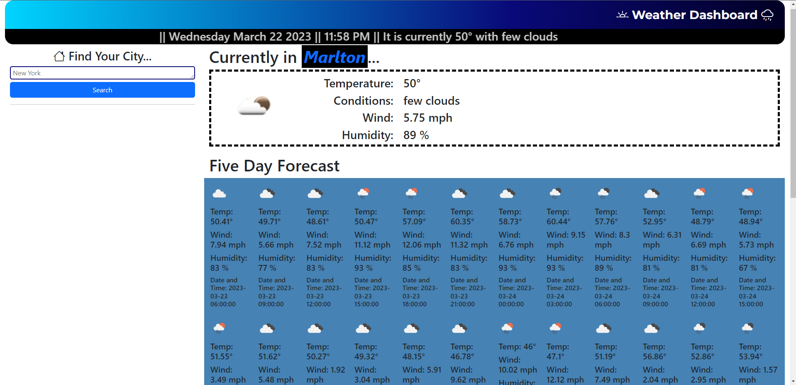

# Weather Dashboard

## Site Description

Weather Dashboard is a server side request widget which harnesses the power of the OpenWeather and Day.JS APIs to deliver current date, time, and weather conditions based on geolocation with the option to search virtually any city in the world. 

## Screenshot

## Deployed Site

[Weather Dashboard](https://ejseader.github.io/weather-dashboard)